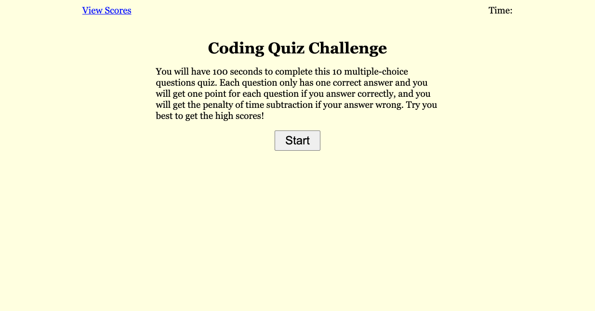
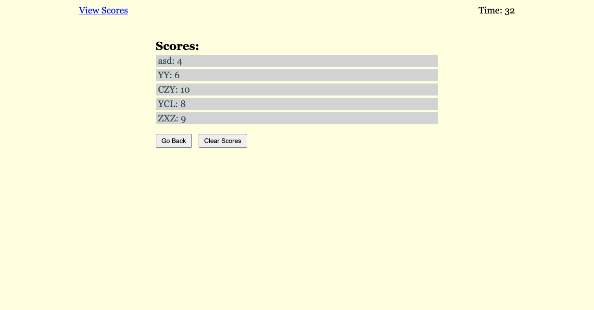

# Code-Quiz

## Task

The purpose of this assignment is to create a web application of coding quiz challenge with html, CSS, and javascript with the field of API. This is a one hundred seconds quiz with ten multiple-choice questions to test the basic knowledge of front end languages including html, CSS and javascript. All the attempts of each user to this quiz will be saved to their local browsers, and all the attempts can be cleared anytime.

## Acceptance Criteria

```
GIVEN I am taking a code quiz
WHEN I click the start button
THEN a timer starts and I am presented with a question
WHEN I answer a question
THEN I am presented with another question
WHEN I answer a question incorrectly
THEN time is subtracted from the clock
WHEN all questions are answered or the timer reaches 0
THEN the game is over
WHEN the game is over
THEN I can save my initials and score
```

## Appearance and Functionality

Below are the appearance of the quiz application and the scores records after completing the quiz:




## URL Sources

Feel free to check the web application: [https://ywen26.github.io/Code-Quiz/](https://ywen26.github.io/Code-Quiz/)

And github repository: [https://github.com/ywen26/Code-Quiz](https://github.com/ywen26/Code-Quiz)

## Credits

Questions source: [https://quizlet.com/latest](https://quizlet.com/latest)

## License

MIT License

Copyright (c) [2020] [Ywuen Yu]

Permission is hereby granted, free of charge, to any person obtaining a copy of this software and associated documentation files (the "Software"), to deal in the Software without restriction, including without limitation the rights to use, copy, modify, merge, publish, distribute, sublicense, and/or sell copies of the Software, and to permit persons to whom the Software is furnished to do so, subject to the following conditions:

The above copyright notice and this permission notice shall be included in all copies or substantial portions of the Software.

THE SOFTWARE IS PROVIDED "AS IS", WITHOUT WARRANTY OF ANY KIND, EXPRESS OR IMPLIED, INCLUDING BUT NOT LIMITED TO THE WARRANTIES OF MERCHANTABILITY, FITNESS FOR A PARTICULAR PURPOSE AND NONINFRINGEMENT. IN NO EVENT SHALL THE AUTHORS OR COPYRIGHT HOLDERS BE LIABLE FOR ANY CLAIM, DAMAGES OR OTHER LIABILITY, WHETHER IN AN ACTION OF CONTRACT, TORT OR OTHERWISE, ARISING FROM, OUT OF OR IN CONNECTION WITH THE SOFTWARE OR THE USE OR OTHER DEALINGS IN THE SOFTWARE.